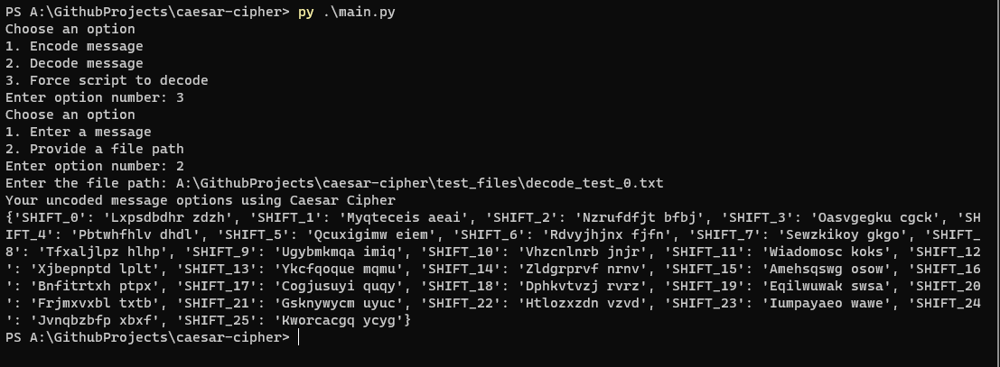

# Caesar Cipher
We've got a couple options.
1. Code message using Caesar Cipher and provided shift value,
2. Decode message using Caesar Cipher and provided shift value,
3. Force script to decode provided message (result saved in json).

# How to run
Inside main directory run __py main.py__

# Example flow

